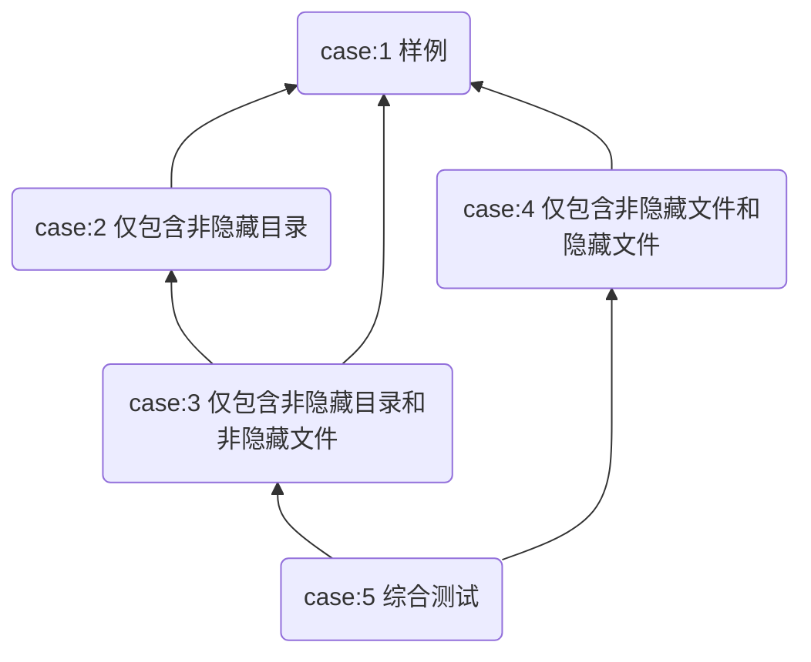
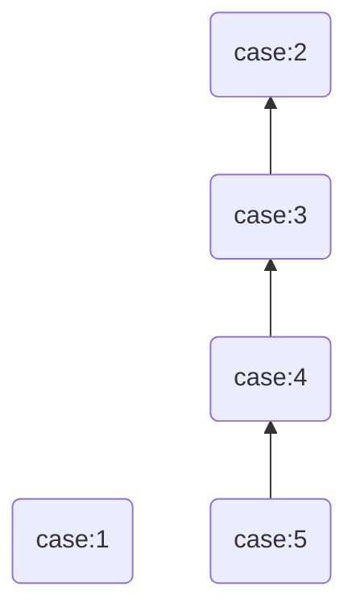

# Lab5上机-问题总结与反思

## 写在前面

Lab5 是我 OS 实验的最后一次上机，也算是给整个 OS 实验画上句号的一次。这次状态非常好，Exam 和 Extra 加起来差不多一个小时就拿到了满分，也算是比较圆满地完成了这一学期的 OS 实验。

回过头看，Lab5 的题面并不是最短的，尤其 Extra 的 Verity 看起来涉及很多文件：`error.h`、`fs.h`、`fsreq.h`、`lib.h`、`fsipc.c`、`file.c`、`serv.c`、`verity_core.c` 等等。但它真正考的不是某个特别刁钻的算法，而是能不能把 Lab5 文件系统服务的调用链路想清楚。只要把“用户态接口 → fsipc 请求 → 文件系统服务端分发 → 核心文件操作”这条链走明白，代码量虽然不少，但每一处该填什么其实都比较确定。

这次能一个小时满分，我觉得主要原因不是手速快，而是 Lab5 课下的文件系统框架已经比较熟了。Exam 的 `file_list` 本质上是目录遍历；Extra 的 Verity 本质上是给文件增加 seal/verify 元数据，再把写保护和打开检查补完整。相比前面几次上机，Lab5 更像是在已经建好的文件系统框架里补一条新功能链路。

## 题面复原

以下为 Lab5 Exam 与 Extra 的题目原文整理。为了方便之后复盘，我保留了原题中的接口、样例和测试点说明。

### 1. Lab5 Exam：简易目录列出服务 `file_list`

### Lab 5 Exam Off

#### 准备工作：创建并切换到 `lab5-exam-off` 分支

请基于已完成的 `lab5` 提交自动初始化 `lab5-exam-off` 分支，然后在开发机依次执行：

```sh
 $ cd ~/学号
 $ git fetch
 $ git checkout lab5-exam-off
```

初始化的 `lab5-exam-off` 分支基于课下完成的 `lab5` 分支，并且在 `tests` 目录下添加了 `lab5-ls` 样例测试目录。

#### 题目背景 & 题目描述

在 Linux 中， `ls`（单词 `list` 的简写）是一条常用命令，可以显示指定工作目录下的内容（列出目前工作目录所含的文件及子目录）。附带参数的 `ls -a` 可以显示出包含隐藏文件在内的所有内容。

在本次测试中，我们希望你实现一个简易的目录列出服务函数 `int file_list(const char *path, u_int all, struct Ls_res *res)` 。该函数支持列出无通配符**绝对路径** `path` 对应的**目录**下的所有文件的名字（当参数 `all` 非 0 时额外列出以 `.` 开头的**隐藏文件**，不用考虑也不用输出 `./` 和 `../`，**无需递归**列出子目录中的文件），并记录文件数量（当 `all` 非 0 时计入隐藏文件数量），将结果存入 `res` 指向的预定义结构体。额外地，你需要区分非目录文件和目录文件：**对于目录文件，你需要在目录文件原有名字的后面增加一个 `/` 字符来区分**。

预定义的存放结果的结构体如下（后面“实现思路”部分还会再次给出）：

```c
struct Ls_res {
	char file_name[MAXLSNUM][MAXLSENTRY];
	int count;
};
```

为了确保你的理解正确，这里给出一个例子。对于以下的目录结构，

```
/
├── .hidden/
│   └── hidden_file
├── dir1/
│   ├── dir1_file1
│   └── dir1_file2
├── dir2/
│   └── dir2_file
├── file1
└── .hidden_file
```

使用 `file_list(path="/", all=0, res)` 后，`res` 中的内容如下：

```c
// file_name 中的顺序不影响评测
// 这里的“=”表示“是”而不是“赋值”
res = {
	file_name[0] = "dir1/"
	file_name[1] = "dir2/"
	file_name[2] = "file1"
	count = 3
}
```

而使用 `file_list(path="/", all=1, res)` 后，`res` 中的内容如下：

```c
// file_name 中的顺序不影响评测
// 这里的“=”表示“是”而不是“赋值”
res = {
	file_name[0] = ".hidden/"
	file_name[1] = "dir1/"
	file_name[2] = "dir2/"
	file_name[3] = "file1"
	file_name[4] = ".hidden_file"
	count = 5
}
```

更为具体的行为规则与实现提示如下。

1. 关于 `all` 参数：
   - 当 `all != 0` 时，列出所有非空目录项（包括以`.`开头的隐藏文件）；
   - 当 `all == 0` 时，不列出以 `.` 开头的文件名。
2. 关于普通文件与目录文件的区分：
   * 如果为目录文件，在 `res` 记录该文件名字时末尾添加 `/` 以示区分（例如 `dir/`）；
   * 如果为普通文件，只记录名字（例如 `file`）。
3. 在识别文件名时，你需要**跳过空名文件**（文件名以 `\0` 开头的文件，这表示它们是磁盘块中还未被使用的文件控制块或被删除了的文件对应的文件控制块）以保证计数正确。
4. 测试点保证你无需考虑找到的指定目录下文件名过长的问题。
5. `Ls_res` 结构体成员 `file_name` 应当从 **`file_name[0]`** 开始填充（无需考虑目录下的文件名顺序问题），成员 **`count`** 用于记录本次请求得到的文件数量，**否则不保证评测正确**。
6. 函数返回值（错误码与课程约定保持一致）：
   - 路径不存在或找不到：`-E_NOT_FOUND`
   - 路径非法（空或过长）：`-E_BAD_PATH`
   - 正常执行：返回 `0`
7. 测试点保证：测试点保证当 `path` 能找到时一定是目录，且 `path` 以 `/` 结尾； `path` 以无通配符的绝对路径给出。

#### 实现思路

01. 在 `user/include/lib.h` 的 `#define pages ((const volatile struct Page *)UPAGES)` 定义后添加查询结果结构体：

```c
#define MAXLSENTRY (MAXNAMELEN + 2)
#define MAXLSNUM ((PAGE_SIZE - sizeof(int)) / MAXLSENTRY)
struct Ls_res {
	char file_name[MAXLSNUM][MAXLSENTRY];
	int count;
};
```

02. 在 `user/include/lib.h` 的 `// file.c` 部分添加声明：

```c
int file_list(const char *path, u_int all, struct Ls_res *res);
```

03. 将 `file_list` 函数的实现添加到 `user/lib/file.c`：

```c
int file_list(const char *path, u_int all, struct Ls_res *res) {
	return fsipc_ls(path, all, res);
}
```

04. 在 `user/include/fsreq.h` 中的枚举类型中增加一个对于文件系统的请求类型 `FSREQ_LS` ，请注意要把它放在 `MAX_FSREQNO` 前；
05. 在 `user/include/fsreq.h` 的 `#endif` 之前添加请求结构体：

```c
struct Fsreq_ls {
	char req_path[MAXPATHLEN];
	u_int req_all;
};
```

06. 在 `user/include/lib.h` 的 `// fsipc.c` 部分新增声明：

```c
int fsipc_ls(const char *path, u_int all, struct Ls_res *res);
```

07. 在 `user/lib/fsipc.c` 中添加 `fsipc_ls` 函数的实现：

```c
int fsipc_ls(const char *path, u_int all, struct Ls_res *res) {
	if (path[0] == '\0' || strlen(path) >= MAXPATHLEN) {
		return -E_BAD_PATH;
	}

	struct Fsreq_ls *req = (struct Fsreq_ls *)fsipcbuf;
	strcpy((char *)req->req_path, path);
	req->req_all = all;

	return fsipc(FSREQ_LS, req, res, 0);
}
```

08. 在 `fs/serv.c` 的服务函数分发表 `serve_table` 最后新增一项：

```c
[FSREQ_LS] = serve_ls
```

09. 在 `fs/serv.c` 中添加 `serve_ls` 函数的实现：

```c
void serve_ls(u_int envid, struct Fsreq_ls *rq) {
	struct Ls_res res __attribute__((aligned(PAGE_SIZE))) = {};
	int r = list_files(rq->req_path, rq->req_all, &res);

	if (r) {
		ipc_send(envid, r, 0, 0);
	} else {
		ipc_send(envid, 0, (const void *)&res, PTE_D | PTE_LIBRARY);
	}
}
```

10. 在 `fs/serv.h` 中添加声明：

```c
int list_files(const char *path, u_int all, struct Ls_res *res);
```

11.  在 `fs/fs.c` 中完成 `list_files` 函数，实现本服务的核心功能。

#### 实现提示

可以在 `fs/fs.c` 中构建一个辅助函数 `list_dir_entries` 用于实现核心功能（遍历目录下的所有文件，将信息填入 `res` ）：

```c
int list_dir_entries(struct File *ls_dir, u_int all, struct Ls_res *res) {
	u_int nblock;
	nblock = ls_dir->f_size / BLOCK_SIZE;

	for (int i = 0; i < nblock; i++) {
		void *blk;
		try(file_get_block(ls_dir, i, &blk));
		struct File *files = (struct File *)blk;

		for (struct File *f = files; f < files + FILE2BLK; ++f) {
			// 按照“行为规则”表述，对当前磁盘块中的每一个文件控制块 f，
			// 完成函数的核心功能。具体功能请参考题面要求。
			// lab5-exam: Your code here. (1/3)

		}
	}
	return 0;
}
```

然后调用辅助函数实现目标函数功能：

```c
int list_files(const char *path, u_int all, struct Ls_res *res) {
	struct File *ls_dir;
	char path1[MAXPATHLEN];
	strcpy(path1, path);  // 将 const char* 转为 char*

	// 找到 path 对应的目录。提示：可能会用到 walk_path。
	// lab5-exam: Your code here. (2/3)

	// 调用辅助函数，完成核心功能。
	// lab5-exam: Your code here. (3/3)

}
```

#### 样例输出 & 本地测试

对于测试样例文件

```c
#include <lib.h>
struct Ls_res res __attribute__((aligned(PAGE_SIZE)));
struct Ls_res ans __attribute__((aligned(PAGE_SIZE))) = {
	.file_name = {
		"file_1",
		"file_2"
	},
	.count = 2
};
int check_id __attribute__((aligned(PAGE_SIZE)));

void sort_res(struct Ls_res *res) {
	int cnt = res->count;
	char tmp[MAXLSENTRY];
	for (int i = 0; i < cnt - 1; i++) {
		for (int j = 0; j < cnt - i - 1; j++) {
			if (strcmp(res->file_name[j], res->file_name[j + 1]) > 0) {
				strcpy(tmp, res->file_name[j]);
				strcpy(res->file_name[j], res->file_name[j + 1]);
				strcpy(res->file_name[j + 1], tmp);
			}
		}
	}
}

void check_res(struct Ls_res *res, struct Ls_res *ans) {
	check_id++;
	sort_res(res);
	sort_res(ans);

	// check: count
	if (res->count == ans->count) {
		debugf("check_%d: \'count\' correct!\n", check_id);
	} else {
		debugf("check_%d: \'count\' wrong!!!\n", check_id);
		return;
	}

	// check: file_name
	for (int i = 0; i < ans->count; i++) {
		if (strcmp(res->file_name[i], "") == 0) {
			debugf("check_%d: one \'file_name\' is empty!\n", check_id);
			return;
		}
	}
	for (int i = 0; i < ans->count; i++) {
		if (strcmp(res->file_name[i], ans->file_name[i]) != 0) {
			debugf("check_%d: one \'file_name\' is wrong!\n", check_id);
			return;
		}
	}
	debugf("check_%d: \'file_name\' correct!\n", check_id);
}

int main() {
	file_list("/bin/", 0, &res);
	check_res(&res, &ans);
	return 0;
}
```

和测试样例文件结构

```
/
└── bin/
    ├── file1
    └── file2
```

应当看到以下输出：

```
check_1: 'count' correct!
check_1: 'file_name' correct!
```

你可以使用 `make test lab=5_ls && make run` 在本地测试上述样例。

如果需要自行设置样例或更改样例评测输出，可以修改 `tests/lab5_ls/` 中 `rootfs/` 中的文件结构、`ls_check.c` 中的评测标准与评测输出。

#### 提交评测 & 评测标准

请在开发机中执行下列命令后，在课程网站上提交评测：

```sh
$ cd ~/学号/
$ git add -A
$ git commit -m "message" # 请将 message 改为有意义的信息
$ git push
```

测试点说明及分数分布如下：

| 测试点序号 |           评测说明           | 分值 |
| :--------: | :--------------------------: | :--: |
|     1      |             样例             |  5   |
|     2      |       仅包含非隐藏目录       |  15  |
|     3      | 仅包含非隐藏目录和非隐藏文件 |  15  |
|     4      |  仅包含非隐藏文件和隐藏文件  |  15  |
|     5      |           综合测试           |  50  |

测试点依赖关系如下（箭头方向表示依赖方向）：



### 2. Lab5 Extra：简化 Verity 文件完整性校验机制

### Lab 5 Extra Off

#### 准备工作

请在自动初始化分支后，在开发机依次执行：

```console
$ cd ~/学号
$ git fetch
$ git checkout lab5-extra-off
```

初始化的 `lab5-extra-off` 分支基于你课下完成的 `lab5` 分支，并且在 `tests` 目录下添加了 `lab5_verity` 样例测试目录。

#### 题目背景 & 功能概览

完成 Lab5 后，MOS 已经能够通过文件系统服务进程管理普通文件的打开、映射、读写、截断和写回。本题在此基础上加入一个简化的 Verity（完整性校验）机制：当一个普通文件被 seal（密封）后，文件系统需要把它视为只读文件，并在之后的访问过程中校验其内容是否仍与 seal 时一致。

本题需要支持以下功能：

1. 对普通文件调用 `fseal(path)`，记录该普通文件当前的大小和全文件摘要，并把它标记为 sealed（被密封）。
2. 对 sealed 普通文件调用 `fverify(path)`，重新计算摘要并与保存值比较，不一致返回 `-E_VERIFY`。
3. sealed 文件不能再通过正常写路径修改。使用 `O_WRONLY`、`O_RDWR` 或带 `O_TRUNC` 打开 sealed 文件时，应返回 `-E_SEALED`。
4. 使用 `O_RDONLY` 打开 sealed 文件时，应先进行完整性校验。

本题还提供了 `fs_debug_corrupt()` 作为测试辅助接口。它用于绕过正常写路径篡改数据块，帮助检查校验逻辑是否能发现内容变化。

本题新增的错误码含义如下：

1. `-E_VERIFY`：sealed 文件摘要校验失败。
2. `-E_SEALED`：试图通过正常写路径修改 sealed 文件。

#### 实现思路

##### 1. Verity 核心实现

**在 `include/error.h` 中引入本题所需错误码：**

```c
// File not a valid executable
#define E_NOT_EXEC 13

// -------------- 新增开始  --------------

// Verity digest mismatch on a sealed file
#define E_VERIFY 14

// Attempt to write to a sealed file
#define E_SEALED 15

// -------------- 新增结束  --------------
```

**在 `user/include/fs.h` 中引入本题所需数据结构：**

```c
struct File {
	char f_name[MAXNAMELEN];
	uint32_t f_size;
	uint32_t f_type;
	uint32_t f_direct[NDIRECT];
	uint32_t f_indirect;
	struct File *f_dir;
	char f_pad[FILE_STRUCT_SIZE - MAXNAMELEN - (3 + NDIRECT) * 4 - sizeof(void *)];
} __attribute__((aligned(4), packed));

// -------------- 新增开始  --------------

#define FVERITY_MAGIC 0x56545931
#define FVERITY_SEALED 0x1

struct FileVerity {
	uint32_t v_magic;  // verity 数据魔数
	uint32_t v_flags;  // sealed 状态标记
	uint32_t v_size;   // seal 时记录的文件大小
	uint32_t v_digest; // seal 时记录的全文件摘要
};

static inline struct FileVerity *file_verity(struct File *f) {
	return (struct FileVerity *)f->f_pad;
}

static inline int file_is_sealed(struct File *f) {
	struct FileVerity *v = file_verity(f);
	return v->v_magic == FVERITY_MAGIC && (v->v_flags & FVERITY_SEALED);
}

// -------------- 新增结束  --------------

#define FILE2BLK (BLOCK_SIZE / sizeof(struct File))
```

注意：

1. `FileVerity` 存放在 `struct File` 末尾的 `f_pad` 中，不改变 `FILE_STRUCT_SIZE`。
2. `v_magic` 当值为 `FVERITY_MAGIC` 时，说明 `f_pad` 中保存的是有效的 verity 数据。
3. 当`v_flags` 包含 `FVERITY_SEALED` 时表示文件已 seal。
4. `v_size` 记录 seal 时的文件大小，用于在校验时发现文件大小变化。
5. `v_digest` 记录 seal 时的全文件摘要，用于之后的完整性校验。
6. 你可以调用 `file_verity()` 函数来得到该文件的 FileVerity 结构体。
7. 你可以调用 `file_is_sealed()` 函数来判断一个文件是否 sealed 。

**在 `fs/verity_core.c` 中补全 Verity 机制核心实现：**

1. 在 `file_seal()` 中为普通文件建立 verity 数据。

```c
	if (!file_regular(f)) {
		return -E_INVAL;
	}

	// Lab5-Extra: Your code here. (1/6)
	// 调用 file_digest() 计算当前文件的全文件摘要。
	// 然后填写该文件的 FileVerity 结构体，
	// 需要填写的字段有：v_magic、v_flags、v_size 和 v_digest。

	// Lab5-Extra: End (1/6).

	file_close(f);
```

注意：
* `int file_digest(struct File *f, uint32_t *hash_store)` 用于计算文件 `f` 当前内容的全文件摘要。调用成功时返回 `0`，并把摘要写入第二个参数指向的变量；调用失败时返回对应错误码。你可以直接调用该函数来计算当前文件的全文件摘要。
* 可调用 `file_verity(f)` 得到该文件的 `FileVerity` 结构体；
* `v_size` 应填写为当前文件大小 `f_size`；
* 若 `file_digest()` 返回错误，应直接返回该错误码。

2. 在 `file_verify()` 中校验 sealed 文件内容是否仍与 seal 时一致。

```c
	if (f->f_size != v->v_size) {
		return -E_VERIFY;
	}

	// Lab5-Extra: Your code here. (2/6)
	// 调用 file_digest() 重新计算摘要，并与 v->v_digest 比较。

	// Lab5-Extra: End (2/6).

	return 0;
```

注意：
* 若重新计算摘要失败，应直接返回该错误码；
* 若重新计算出的摘要与 `v->v_digest` 不一致，返回 `-E_VERIFY`；
* 校验通过时返回 `0`。

##### 2. 用户态接口与文件系统请求

本题需要把三个新用户态请求接入文件系统服务端。整体链路如下：

```text
fseal(path)           -> fsipc_seal(path)         -> FSREQ_SEAL          -> serve_seal()          -> file_seal()
fverify(path)         -> fsipc_verify(path)       -> FSREQ_VERIFY        -> serve_verify()        -> file_verify()
fs_debug_corrupt(...) -> fsipc_debug_corrupt(...) -> FSREQ_DEBUG_CORRUPT -> serve_debug_corrupt() -> file_debug_corrupt()
```

下面以 `fs_debug_corrupt(...) -> fsipc_debug_corrupt(...) -> FSREQ_DEBUG_CORRUPT -> serve_debug_corrupt() -> file_debug_corrupt()` 这条链路为示例进行接入，另外两条 `seal` / `verify` 链路请在后文参照它自行完成。

###### 2.1 注册请求号

在 `user/include/fsreq.h` 中引入 `FSREQ_DEBUG_CORRUPT` 请求号：

```c
	FSREQ_REMOVE,
	FSREQ_SYNC,
	// -------------- 新增开始  --------------
	FSREQ_DEBUG_CORRUPT,
	// -------------- 新增结束  --------------
	MAX_FSREQNO,
};
```
注意新引入的请求号要在 `MAX_FSREQNO` 之前。

###### 2.2 定义请求结构体

然后加入所需的请求结构体：

```c
	MAX_FSREQNO,
};

// -------------- 新增开始  --------------

struct Fsreq_debug_corrupt {
	char req_path[MAXPATHLEN];
	u_int req_block_index;
	u_int req_byte_offset;
	u_int req_value;
};

// -------------- 新增结束  --------------

struct Fsreq_open {
	char req_path[MAXPATHLEN];
	u_int req_omode;
};
```

###### 2.3 声明用户态函数

在 `user/include/lib.h` 中加入所需函数声明：

先引入新增的 fsipc 函数声明：

```c
int fsipc_sync(void);
int fsipc_incref(u_int);
// -------------- 新增开始  --------------
int fsipc_debug_corrupt(const char *path, u_int block_index, u_int byte_offset, u_int value);
// -------------- 新增结束  --------------
```

再引入所需的用户接口函数声明：

```c
int ftruncate(int fd, u_int size);
int sync(void);
// -------------- 新增开始  --------------
int fs_debug_corrupt(const char *path, u_int block_index, u_int byte_offset, u_int value);
// -------------- 新增结束  --------------
```

###### 2.4 实现用户态 fsipc 函数

在 `user/lib/fsipc.c` 中实现函数 `fsipc_debug_corrupt()`：

```c
int fsipc_sync(void) {
	return fsipc(FSREQ_SYNC, fsipcbuf, 0, 0);
}

// -------------- 新增开始  --------------

int fsipc_debug_corrupt(const char *path, u_int block_index, u_int byte_offset, u_int value) {
	struct Fsreq_debug_corrupt *req;

	if (path == 0 || path[0] == '\0' || strlen(path) >= MAXPATHLEN) {
		return -E_BAD_PATH;
	}

	// 将 fsipcbuf 转为对应的结构体指针。
	req = (struct Fsreq_debug_corrupt *)fsipcbuf;
	// 填写请求结构体中的各个字段。
	strcpy((char *)req->req_path, path);
	req->req_block_index = block_index;
	req->req_byte_offset = byte_offset;
	req->req_value = value;
	// 调用 fsipc() 发送请求号和请求结构体。
	return fsipc(FSREQ_DEBUG_CORRUPT, req, 0, 0);
}

// -------------- 新增结束  --------------
```

###### 2.5 实现用户接口

在 `user/lib/file.c` 中实现函数 `fs_debug_corrupt()`。该函数作为用户程序直接调用的接口只负责转发参数：

修改后应为：

```c
int sync(void) {
	return fsipc_sync();
}

// -------------- 新增开始  --------------

int fs_debug_corrupt(const char *path, u_int block_index, u_int byte_offset, u_int value) {
	return fsipc_debug_corrupt(path, block_index, byte_offset, value);
}

// -------------- 新增结束  --------------
```

###### 2.6 注册服务端处理函数

`fs/verity_serv.c` 已经给出了三条链路的服务端处理函数。只需要在 `fs/serv.c` 的 `serve_table` 中注册好对应的函数即可：

```c
void *serve_table[MAX_FSREQNO] = {
    [FSREQ_OPEN] = serve_open,
    [FSREQ_MAP] = serve_map,
    [FSREQ_SET_SIZE] = serve_set_size,
    [FSREQ_CLOSE] = serve_close,
    [FSREQ_DIRTY] = serve_dirty,
    [FSREQ_REMOVE] = serve_remove,
    [FSREQ_SYNC] = serve_sync,
    // -------------- 新增开始  --------------
    [FSREQ_DEBUG_CORRUPT] = serve_debug_corrupt,
    // -------------- 新增结束  --------------
};
```

###### 2.7 参照示例完成 seal / verify 链路

请你添加好示例链路后，再参照示例，将 `fseal(path)` 和 `fverify(path)` 两条链路也接入 IPC，这两条链路只需要传递 `path` 参数，所以共用 `struct Fsreq_path` 请求结构体。

接入这两条链路时用到的信息如下：

```c
// 请求号
FSREQ_SEAL,
FSREQ_VERIFY,

// 请求结构体
struct Fsreq_path {
	// Lab5-Extra: Your code here. (3/6)
	// 只需要 req_path 参数。

	// Lab5-Extra: End (3/6).
};

// 函数声明
// fsipc 函数
int fsipc_seal(const char *path);
int fsipc_verify(const char *path);
// 用户接口函数
int fseal(const char *path);
int fverify(const char *path);

// 你可使用以下框架实现相关 fsipc 函数
int fsipc_seal(const char *path) {
	struct Fsreq_path *req;

	if (path == 0 || path[0] == '\0' || strlen(path) >= MAXPATHLEN) {
		return -E_BAD_PATH;
	}

	// Lab5-Extra: Your code here. (4/6)
	// 将 fsipcbuf 转为对应的结构体指针，填写 req_path，并调用 fsipc() 发送对应请求。

	// Lab5-Extra: End (4/6).
}

int fsipc_verify(const char *path) {
	struct Fsreq_path *req;

	if (path == 0 || path[0] == '\0' || strlen(path) >= MAXPATHLEN) {
		return -E_BAD_PATH;
	}

	// Lab5-Extra: Your code here. (5/6)
	// 将 fsipcbuf 转为对应的结构体指针，填写 req_path，并调用 fsipc() 发送对应请求。

	// Lab5-Extra: End (5/6).
}
```

此处给出一个 TODO list 方便同学们对照：

- [ ] 注册请求号
- [ ] 新增请求结构体
- [ ] 声明用户态函数，包括 `fsipc` 与接口函数
- [ ] 实现 `fsipc` 接口函数
- [ ] **自行实现用户态接口函数**
- [ ] 在 `serve_table` 中注册好对应的 `serve` 函数 （`serve_seal` 与 `serve_verify`）


##### 3. 在 `serve_open()` 中加入 sealed 文件的打开检查

先在`fs/serv.c`文件顶部引入 `fs/verity_internal.h`：

```c
#include "serv.h"
// -------------- 新增开始  --------------
#include "verity_internal.h"
// -------------- 新增结束  --------------
#include <fd.h>
```

然后在 `serve_open()` 中加入 sealed 文件的打开检查，位置在保存文件指针之后、执行 `O_TRUNC` 之前：

```c
	// Save the file pointer.
	o->o_file = f;

	// Lab5-Extra: Your code here. (6/6)
	// 若 f 已 sealed：
	// 1. 遇到 O_TRUNC、O_WRONLY 或 O_RDWR，向请求进程返回 -E_SEALED 并 return；
	// 2. 只读打开时调用 file_verify(f)，若返回错误则把该错误返回给请求进程并 return。

	// Lab5-Extra: End (6/6).

	// If mode include O_TRUNC, set the file size to 0
	if (rq->req_omode & O_TRUNC) {
```

注意：

- 你可以调用 `file_is_sealed()` 函数来判断一个文件是否 sealed 。

- 你可以使用 `(rq->req_omode & O_ACCMODE)` 判断文件打开模式。如果你对文件打开模式不熟悉，可以查阅 `user\include\lib.h`。

#### 样例输出 & 本地测试

对于如下用户程序样例：

```c
#include <error.h>
#include <lib.h>
#include <string.h>

static void expect_eq(int got, int want, const char *step) {
	if (got != want) {
		user_panic("case1 sample: %s returned %d, expected %d", step, got, want);
	}
}

static void expect_nonneg(int got, const char *step) {
	if (got < 0) {
		user_panic("case1 sample: %s returned %d, expected non-negative", step, got);
	}
}

static void finish(void) {
	int r;
	syscall_read_dev(&r, 0x10000010, 4);
}

static void create_text_file(const char *path, const char *data) {
	int fd, r;
	u_int len;

	fd = open(path, O_CREAT | O_RDWR | O_TRUNC);
	expect_nonneg(fd, "open file for create");
	len = strlen(data);
	if (len != 0) {
		r = write(fd, data, len);
		expect_eq(r, len, "write initial content");
	}
	expect_eq(close(fd), 0, "close created file");
}

static void check_text_file(const char *path, const char *data) {
	char buf[64];
	int fd, r;
	u_int len;

	fd = open(path, O_RDONLY);
	expect_nonneg(fd, "open sealed file read-only");
	memset(buf, 0, sizeof(buf));
	len = strlen(data);
	r = read(fd, buf, len);
	expect_eq(r, len, "read sealed file content");
	if (strcmp(buf, data) != 0) {
		user_panic("case1 sample: sealed file content mismatch");
	}
	expect_eq(close(fd), 0, "close sealed file after read");
}

int main(void) {
	char buf[8];
	int fd;
	const char *msg = "hello verity";

	debugf("verity 1 begin\n");

	create_text_file("/v1_empty", "");
	expect_eq(fseal("/v1_empty"), 0, "fseal empty file");
	expect_eq(fverify("/v1_empty"), 0, "fverify empty file");
	fd = open("/v1_empty", O_RDONLY);
	expect_nonneg(fd, "open sealed empty file");
	expect_eq(read(fd, buf, sizeof(buf)), 0, "read sealed empty file");
	expect_eq(close(fd), 0, "close sealed empty file");
	debugf("verity 1 empty seal verify ok\n");

	create_text_file("/v1_short", msg);
	expect_eq(fseal("/v1_short"), 0, "fseal short file");
	expect_eq(fverify("/v1_short"), 0, "fverify short file");
	expect_eq(fseal("/v1_short"), 0, "repeat fseal short file");
	expect_eq(fverify("/v1_short"), 0, "fverify short file after repeat seal");
	debugf("verity 1 short seal verify ok\n");

	check_text_file("/v1_short", msg);
	debugf("verity 1 readonly content ok\n");

	debugf("verity 1 ok\n");
	finish();
	return 0;
}
```

应当输出以下关键内容：

```text
verity 1 begin
verity 1 empty seal verify ok
verity 1 short seal verify ok
verity 1 readonly content ok
verity 1 ok
```

##### 样例说明

1. 样例创建空文件 `/v1_empty`，调用 `fseal()` 生成摘要信息，再调用 `fverify()` 校验，随后以只读方式打开、读取并关闭该 sealed 文件。
2. 样例创建短文件 `/v1_short`，写入 `hello verity`，检查短文件的 seal/verify、重复 seal、只读打开、读取内容和关闭流程。
3. 该样例同时也是提交评测中的第 1 个测试点，`make test lab=5_verity` 会运行与该测试点一致的本地样例。

你可以使用：

* `make test lab=5_verity && make run` 在本地测试上述样例（调试模式）
* `MOS_PROFILE=release make test lab=5_verity && make run` 在本地测试上述样例（开启优化）

#### 提交评测

```console
$ cd ~/学号
$ git add -A
$ git commit -m "message"
$ git push
```

在线评测时，`.mk` 文件、`Makefile` 文件、`init/init.c`、`tests/` 和 `tools/` 目录可能被替换为标准版本，请不要把实际功能逻辑写在这些文件中。

#### 评测标准

| 测试点序号 | 评测内容                         | 分数 |
| ---------- | -------------------------------- | ---- |
| 1          | 样例：空文件和短文件 seal/verify | 15   |
| 2          | 接入新增IPC请求链路              | 20   |
| 3          | Verity 核心实现                  | 20   |
| 4          | sealed 文件写保护和 open 校验    | 25   |
| 5          | 综合测试                         | 20   |

测试点依赖关系如下（箭头方向表示依赖方向）：



## 解答与反思

### 1. Exam：`file_list` 本质上是在文件系统服务端做目录遍历

Lab5 Exam 这题表面上是在实现一个简易版 `ls`，但从 OS 实验的角度看，它真正考的是文件系统服务的 IPC 链路是否熟悉。完整链路大概是：

```text
file_list(path, all, res)
    -> fsipc_ls(path, all, res)
    -> FSREQ_LS
    -> serve_ls(envid, rq)
    -> list_files(path, all, res)
    -> list_dir_entries(ls_dir, all, res)
```

所以这题不能只盯着 `list_files` 写。它需要把用户态结构体、请求号、请求结构体、fsipc 函数、服务端分发表和真正的目录遍历函数全部接起来。只要其中一个名字写错，或者 `serve_table` 里忘了注册，用户态看起来就像什么都没发生，调试会很烦。

我当时做这题的思路是先把链路搭通，再处理目录项细节：

1. `lib.h` 中加入 `struct Ls_res` 和 `file_list` / `fsipc_ls` 声明；
2. `fsreq.h` 中加入 `FSREQ_LS` 和 `struct Fsreq_ls`；
3. `file.c` 中让 `file_list` 直接调用 `fsipc_ls`；
4. `fsipc.c` 中把 `path` 和 `all` 填进 `fsipcbuf`，然后调用 `fsipc(FSREQ_LS, req, res, 0)`；
5. `serv.c` 中写 `serve_ls`，并在 `serve_table` 注册；
6. `fs.c` 中实现真正的 `list_files` 和目录遍历。

核心遍历其实并不复杂。先用 `walk_path` 找到 `path` 对应的目录，再按块取出目录文件的数据块。每个数据块里是一组 `struct File`，遍历这些文件控制块时注意三件事就可以：

- 文件名为空的目录项要跳过，因为这是未使用或已删除的文件控制块；
- `all == 0` 时跳过以 `.` 开头的隐藏文件；
- 如果当前文件是目录，就在名字后面补一个 `/`。

我觉得这题最容易错的地方不是遍历，而是结果结构体的填法。题目要求 `file_name` 必须从 `file_name[0]` 开始连续填，`count` 要准确记录数量。不要用原目录项下标直接当 `res` 下标，否则中间跳过隐藏文件或空名文件以后，`res` 里面会出现空洞。

这题拿满分的关键是“链路完整 + 计数连续 + 目录加斜杠”。只要这三个点不漏，基本不会有太大问题。

### 2. Extra：Verity 不是难在哈希，而是难在接入整条文件系统链路

Lab5 Extra 是一个简化版的 Verity 机制。题面看起来很长，但抽象一下其实就是三件事：

```text
seal：记录文件当前大小和摘要，并标记 sealed
verify：重新计算文件摘要，与 seal 时记录的值比较
open：sealed 文件禁止写方式打开，只读打开前先校验
```

这题我一开始先看 Verity 的核心结构：`FileVerity` 被放在 `struct File` 的 `f_pad` 里，不改变文件控制块大小。它有四个字段：

```c
struct FileVerity {
    uint32_t v_magic;
    uint32_t v_flags;
    uint32_t v_size;
    uint32_t v_digest;
};
```

其中 `v_magic` 用来判断这块 `f_pad` 是不是有效的 Verity 信息，`v_flags` 记录 sealed 状态，`v_size` 保存 seal 时文件大小，`v_digest` 保存 seal 时的文件摘要。

所以 `file_seal()` 的核心就是：

```text
检查是不是普通文件
调用 file_digest() 算当前摘要
写入 magic / flags / size / digest
关闭文件
```

`file_verify()` 的核心就是：

```text
先检查当前文件大小是否等于 seal 时大小
重新调用 file_digest() 算摘要
和 v_digest 比较
不一致就返回 -E_VERIFY
```

这部分没有太多绕的地方。真正需要细心的是 IPC 链路。Extra 要接三条链路：

```text
fseal(path)           -> fsipc_seal(path)         -> FSREQ_SEAL          -> serve_seal()          -> file_seal()
fverify(path)         -> fsipc_verify(path)       -> FSREQ_VERIFY        -> serve_verify()        -> file_verify()
fs_debug_corrupt(...) -> fsipc_debug_corrupt(...) -> FSREQ_DEBUG_CORRUPT -> serve_debug_corrupt() -> file_debug_corrupt()
```

`fs_debug_corrupt` 是样例链路，照着它把 `seal` 和 `verify` 接上就行。这里容易漏的地方有：

- `FSREQ_SEAL` 和 `FSREQ_VERIFY` 要放在 `MAX_FSREQNO` 前；
- `struct Fsreq_path` 只需要一个 `req_path`；
- `fsipc_seal` / `fsipc_verify` 要检查空路径和路径过长；
- 用户态接口 `fseal` / `fverify` 不能只声明不实现；
- `serve_table` 里必须注册 `serve_seal` 和 `serve_verify`。

最后一个关键点是 `serve_open()`。这一步决定 sealed 文件是否真的被保护起来。逻辑应该放在保存 `o->o_file = f` 之后、执行 `O_TRUNC` 之前。原因也很直观：如果先执行 `O_TRUNC`，sealed 文件就已经被正常写路径改掉了，保护就失效了。

判断逻辑是：如果 `file_is_sealed(f)` 为真，那么：

```text
O_TRUNC / O_WRONLY / O_RDWR -> 返回 -E_SEALED
O_RDONLY                    -> 调用 file_verify(f)，失败则返回对应错误码
```

这里要注意 `O_ACCMODE` 的使用。不能只简单判断某个 bit，否则容易误判打开模式。只读打开不是“没有写 bit 就一定没问题”，而是要按题目给的模式语义来区分。

### 3. 套路

这次做得很顺，一个小时左右就拿满分了，我觉得主要是因为前面几个 Lab 已经把 MOS 的“套路”练出来了。

Lab2 主要是页表、自映射和宏；Lab3 是调度和异常；Lab4 是系统调用、页表权限和异常处理；到了 Lab5，文件系统服务虽然换了一个场景，但它的本质仍然是链路题。只要先画出数据从哪里来、经过哪里、最后在哪里真正生效，就不会被题面里的大量文件名吓住。

Lab5 Exam 的链路是：

```text
用户态 file_list
-> fsipc_ls
-> 文件系统服务端 serve_ls
-> list_files
-> 遍历目录项
-> 把结果映射/返回给用户态
```

Lab5 Extra 的链路是：

```text
用户态 fseal/fverify
-> fsipc_seal/fsipc_verify
-> serve_seal/serve_verify
-> file_seal/file_verify
-> serve_open 中强制 sealed 文件只读并校验
```

这两题的共同点是：单个函数都不算特别难，但必须把所有层都接上。也正因为如此，我做的时候没有先去写最核心的遍历或摘要，而是先把“接口—请求—分发—实现”这条线完整补齐。这样本地测试如果失败，也能很快定位是链路断了还是核心逻辑错了。

### 4. 一些具体坑点记录

#### `file_list` 不能把空目录项算进去

目录文件底层也是由若干 `struct File` 组成的。并不是每个 `struct File` 都代表有效文件，文件名首字符为 `\0` 的项要跳过。不跳过的话，`count` 会变大，结果里也会混入空字符串。

#### 隐藏文件判断只看文件名首字符

题目里的隐藏文件规则很简单：名字以 `.` 开头就是隐藏文件。`all == 0` 时跳过，`all != 0` 时保留。不需要考虑 `./` 和 `../`，也不需要递归。

#### 目录名后补 `/` 要注意空间

题目保证文件名不会过长，所以可以直接在复制名字之后判断目录类型，再追加 `/` 和 `\0`。但是仍然要意识到 `MAXLSENTRY` 比 `MAXNAMELEN` 多了 2，就是为了容纳这个 `/` 和结尾的 `\0`。

#### `fseal` 可以重复调用

样例里对 `/v1_short` 调用了两次 `fseal`。这说明重复 seal 不应该报错，而是重新记录当前文件的 size 和 digest。因为 sealed 文件正常情况下已经不能写，所以重复 seal 的结果应当仍然能 verify 通过。

#### sealed 文件的写保护一定要放在 `O_TRUNC` 前

这个坑很关键。`O_TRUNC` 本身就是一种修改文件的行为，如果先 truncate 再检查 sealed，就已经晚了。所以 `serve_open()` 里的 sealed 检查必须在 `O_TRUNC` 处理之前。

#### 只读打开 sealed 文件也要校验

`O_RDONLY` 不修改文件，但题目要求只读打开 sealed 文件时先进行完整性校验。也就是说，如果有人通过 `fs_debug_corrupt()` 绕过正常路径篡改了数据，那么下一次只读打开也应该返回 `-E_VERIFY`，而不是继续让用户读到被污染的数据。

### 5. OS 实验的收尾感受

刚开始做 OS 实验的时候，经常会觉得一个功能分散在很多文件里，很难知道到底该从哪里下手。但做到后面会发现，MOS 的实验其实一直在训练同一种能力：把一个系统功能拆成清晰的层次，然后沿着调用链一点点补齐。

从Lab0的Makefile，到 Lab2 的页表和自映射，再到 Lab3 的调度与异常，Lab4 的系统调用和页写入异常，最后到 Lab5 的文件系统服务，整个过程其实是在一点点把操作系统从底层搭起来。Lab5 这次能顺利满分，也算是对前面所有实验积累的一个正反馈。

最后这一场上机结束以后，OS 实验也就圆满完成了。虽然中间有过数次Extra没做出来的遗憾，也有很多时候对着长题面发懵，但最后能以 Lab5 各一发通过，还是挺开心的。至此，大二再无上机压力。
